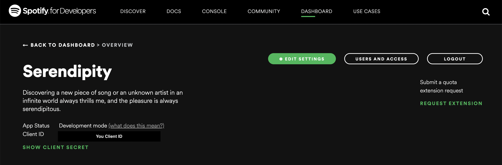

# Getting Started with Song Recommendation Search Engine
This project was bootstapped with [Ant Design](https://ant.design/).

## Available Scripts

In the project directory, you can run\

 `npm start`

and then open [http://localhost:3000](http://localhost:3000) to view it in your browser.

The page will reload when you make changes.\
You may also see any lint errors in the console.

## Before running `npm start`, you should :

Go to [Spotify for Developers](https://developer.spotify.com/) to register a project to get client id and client secret because this project fetches Spotify API to get song recommendation.
To be more specifically.

The step is \
[Spotify for Developers](https://developer.spotify.com/) -> [Dashboard](https://developer.spotify.com/dashboard/) -> Login -> CREATE AN APP 

---

After filling required information, you would see something like this


Copy the **Client ID** and **Client Secret**, do the following command under the root directory of the project.
1. vim .env
2. Edit your .env by pasting 
3. REACT_APP_AP_CLIENT_ID=Your CLIENT_ID
REACT_APP_AP_CLIENT_SECRET=Your CLIENT_SECRET

if not creating your own cliet id and secret, you may encounter error due to the code in APIController.js

```javascript
var clientId = process.env.REACT_APP_AP_CLIENT_ID; 
var clientSecret = process.env.REACT_APP_AP_CLIENT_SECRET;
```
